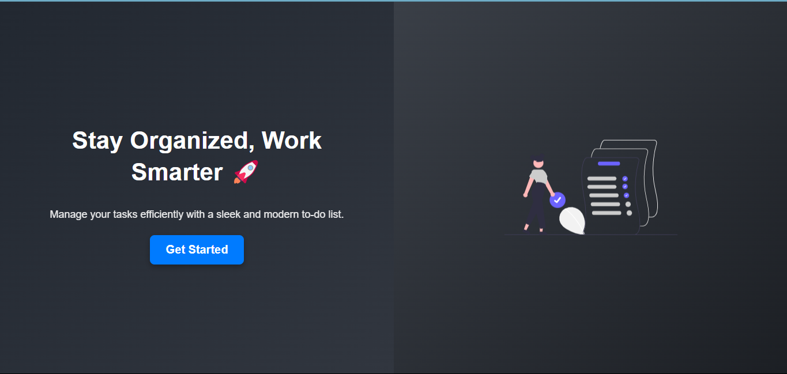
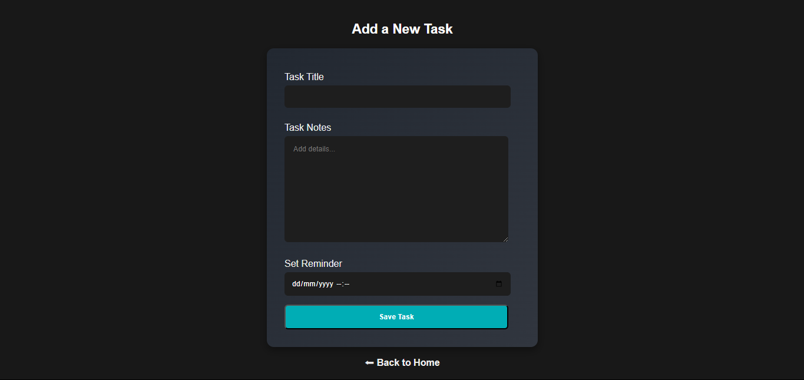
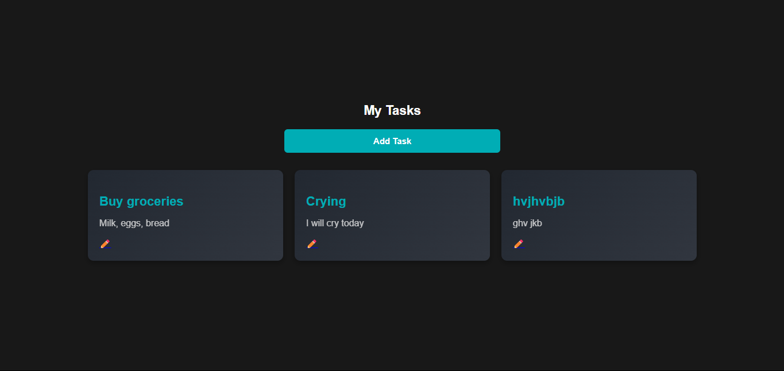

# To-Do App (Java Play Framework + MySQL)

## 📌 Overview
This is a **To-Do List** web application built using the **Play Framework (Java)** and **MySQL** as the database. The app allows users to **add, edit, delete, and manage tasks** with reminders.

Walkthrough video - [Loom Walkthrough Video](https://www.loom.com/share/2096c6737c4841538463188262b047c3?sid=e7cfb793-152a-4250-9b32-2eae950937dd)

## 🛠️ Why I Used Java Play Framework
I’ve always worked with Node or PHP, so I challenged myself to build a full-stack project with Java. Play Framework gave me:
- Type safety
- A robust MVC structure
- Built-in dev server and form helpers

## 🛠️ Tech Stack
- **Backend:** Java (Play Framework)
- **Frontend:** HTML, CSS (Bootstrap), JavaScript
- **Database:** MySQL

## 🚀 Features
- ✅ Add new tasks with title, description, and reminders
- ✏️ Edit existing tasks
- ❌ Delete tasks
- 📅 Set reminders for tasks
- 🗂️ View all tasks

### Homepage


### Adding a task


### My tasks

## 🔧 Installation & Setup

### 1️⃣ Prerequisites
Ensure you have the following installed:
- Java 11+
- Play Framework
- MySQL Database
- sbt (Scala Build Tool)

### 2️⃣ Clone the Repository
```bash
git clone https://github.com/yourusername/todo2.git
cd todo2
```

### 3️⃣ Configure MySQL Database
Create a database named `todo_db` and update `conf/application.conf`:
```properties
db.default.driver=com.mysql.cj.jdbc.Driver
db.default.url="jdbc:mysql://localhost:3306/todo_db"
db.default.username="your_mysql_user"
db.default.password="your_mysql_password"
```

### 5️⃣ Run the Application
Start the Play Framework server:
```bash
sbt run
```

### 6️⃣ Access the App
Open your browser and visit:
```
http://localhost:9000/
```

## 📡 API Reference

The backend exposes the following RESTful endpoints:

---

### 🔹 GET `/tasks`

**Description:** Fetches all tasks from the database.

**Response Example:**
```json
[
  {
    "id": 1,
    "title": "Buy groceries",
    "description": "Milk, Bread, Eggs",
    "reminder": "2025-05-20T09:00:00"
  },
  ...
]
```
**🔹 POST /task/save**
Description: Creates a new task.

**Request Body Example:**
```json
{
  "title": "Finish README",
  "description": "Make it look pro",
  "reminder": "2025-05-20T14:00:00"
}
```
**Response Example:**
```json
{
  "message": "Task saved successfully",
  "taskId": 5
}
```
**🔹 GET /task/edit/:id**
Description: Retrieves a specific task for editing.

**Example:**

```json
{
  "id": 5,
  "title": "Finish README",
  "description": "Make it look pro",
  "reminder": "2025-05-20T14:00:00"
}
```
**🔹 GET /task/delete/:id**
Description: Deletes the task with the specified ID.

**Example:**

**Response Example:**
```json
{
  "message": "Task deleted successfully"
}
```
## 📜 Folder Structure
```
📂 app
 ┣ 📂 controllers  # Contains Java controllers
 ┣ 📂 models       # Contains data models
 ┣ 📂 views        # Contains HTML templates
📂 conf
 ┣ 📄 application.conf  # Configuration file
📂 public
 ┣ 📂 stylesheets  # CSS files
 ┣ 📂 javascript   # JavaScript files
📂 migrations      # Database migration files
```

📚 What I Learned
- Setting up Play Framework with a MySQL database

- Writing modular MVC code in Java

- Designing and documenting clean API endpoints

- Communicating technical details clearly with docs & visuals

🚀 What’s Next?
I’d love to:

- Add authentication for users

- Improve the UI/UX further

- Deploy this publicly on Render or Railway

## 📖 Blog Post  
Curious about how I built this? Check out the full breakdown here 👉 [Read the blog post](https://mugeha585.hashnode.dev/building-a-to-do-app-with-java-play-framework-and-mysql)


## 🛠️ Contributing
Feel free to contribute by **forking** the repository and creating a **pull request**.

## 📄 License
This project is licensed under the MIT License.


